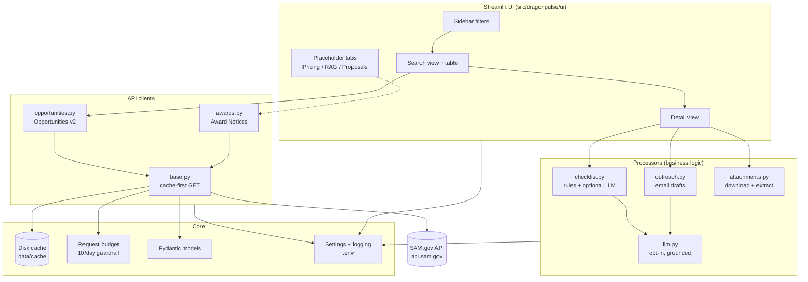

# 🐉 DragonPulse

**Local-first SAM.gov opportunity intelligence for government contractors.**

DragonPulse helps a small/mid-size contractor team **discover** SAM.gov
opportunities, understand **who to contact** and **what to do next**, analyze
**historical award pricing**, maintain a **RAG knowledge base** of past
proposals, and generate **grounded, compliant proposal drafts** — all running
locally on your machine.

> **Design philosophy:** everything local, official APIs only, cache‑first to
> respect tight rate limits, and **every AI output is grounded** in (and cites)
> retrieved context or opportunity metadata. No cloud vector DBs, no mandatory
> external LLM.

---

## ✅ What works today (MVP)

- **SAM.gov Opportunities v2** search with sidebar filters (keyword, NAICS,
  set‑asides, notice types, agency, posted‑date range).
- **Cache‑first API client** with disk caching, a **daily live‑request budget
  guardrail** (protects the 10‑requests/day basic key), pagination, typed
  Pydantic models, and graceful, rate‑limit‑aware error handling.
- **Results table** with key fields + CSV export and direct SAM.gov links.
- **Opportunity detail view**:
  - Full parsed metadata.
  - **Who to reach out to** — every point of contact + one‑click **outreach
    email draft** (grounded template, or LLM‑generated if you opt in).
  - **What needs to be done** — a tailored, **source‑cited** action checklist
    (rules engine + optional LLM enrichment) with deadlines, exportable to
    Markdown.
  - **Attachments** — download resource links + PDF/text preview.
- **Placeholder tabs** wired in for the next modules: Pricing, Knowledge Base
  (RAG), Proposals.

- **Pricing intelligence** (live): pulls historical **Award Notices** for your
  sidebar filters, computes count/min/median/mean/max, charts the award‑amount
  distribution, and lists comparable awards (awardee + amount) with CSV export.
- **RAG knowledge base** (local): upload past proposals/performance (PDF, DOCX,
  TXT, MD), index them into an **on‑disk vector store**, and run grounded
  search where every hit **cites its source document + chunk**. Works offline
  with a pure‑NumPy hashing embedding; **auto‑upgrades to semantic embeddings
  via local Ollama** when configured (see below).

> 🚧 **Not yet built (next phase, awaiting your go‑ahead):** the proposal
> generator. Its building blocks (attachment extraction, grounded LLM wrapper,
> the RAG knowledge base) are already in place.

---

## 🏗️ Architecture



### Request flow (cache‑first)

```text
search() ─▶ build query params ─▶ DiskCache.get()
                                     │ hit (fresh)  ─▶ return cached  ✅ (no quota spent)
                                     │ miss/stale   ─▶ RequestBudget.check()
                                                        ─▶ HTTP GET api.sam.gov (key injected)
                                                        ─▶ RequestBudget.record()
                                                        ─▶ DiskCache.set()  ─▶ return fresh
```

### Project layout

```text
dragonpulse/
├── app.py                         # Streamlit entry point (run this)
├── README.md
├── requirements.txt / -dev.txt
├── pyproject.toml
├── .env.example                   # copy to .env and add your key
├── .streamlit/config.toml
├── data/                          # local-only (gitignored)
│   ├── cache/                     # cached API responses + request budget
│   └── attachments/               # downloaded resource files
├── src/dragonpulse/
│   ├── config/                    # settings (pydantic-settings) + logging
│   ├── cache/                     # disk_cache.py, request_budget.py
│   ├── models/                    # opportunity, award, common, filters
│   ├── api/                       # base, opportunities (v2), awards
│   ├── processors/                # checklist, outreach, attachments, llm,
│   │                              #   pricing, embeddings, text_extract,
│   │                              #   knowledge_base (RAG)
│   └── ui/                        # sidebar, search/detail/pricing/knowledge views
└── tests/                         # pytest: cache, models, checklist, api
```

---

## 🚀 Setup

Requires **Python 3.9+**.

```bash
# 1) Clone / open this folder, then create a virtual environment
python3 -m venv .venv
source .venv/bin/activate          # Windows: .venv\Scripts\activate

# 2) Install dependencies
pip install -r requirements.txt
# (for running tests/linting too)
pip install -r requirements-dev.txt

# 3) Configure your API key
cp .env.example .env
#   then edit .env and set DRAGONPULSE_SAM_API_KEY_BASIC=<your key>
```

### Getting a SAM.gov API key

1. Sign in at <https://sam.gov> and open your **Account Details → API Key**.
2. The personal/basic key allows **10 requests/day** — DragonPulse is built to
   stay well under this via caching and a request‑budget guardrail.
3. Paste it into `.env` as `DRAGONPULSE_SAM_API_KEY_BASIC`.

### Switching to a higher‑tier key later

When your entity registration completes and you receive a system‑account key:

```dotenv
DRAGONPULSE_SAM_API_KEY_SYSTEM=your-higher-limit-key
DRAGONPULSE_API_KEY_TIER=system        # was "basic"
DRAGONPULSE_DAILY_REQUEST_BUDGET=900   # raise the guardrail to match
```

No code changes required.

---

## ▶️ Running the app

```bash
streamlit run app.py
```

Then open the URL Streamlit prints (usually <http://localhost:8501>).

1. Set filters in the sidebar (try a broad keyword + a 14–30 day posted range).
2. Click **🔍 Search** (cache‑first) or **↻ Force refresh** (spends 1 request).
3. Pick an opportunity in **Open an opportunity detail**, then switch to the
   **📄 Detail** tab for contacts, checklist, and attachments.

### Conserving your 10/day quota during development

- The **sidebar Status panel** shows live requests used today and cache stats.
- Cached results are reused for `DRAGONPULSE_CACHE_TTL_SECONDS` (default 12h)
  and **do not** count against your daily budget.
- The client refuses live calls once `DRAGONPULSE_DAILY_REQUEST_BUDGET` is hit
  (default 9, leaving headroom under the 10 limit).
- Tip: do **one** real search per filter set, then iterate against the cache.

---

## 🤖 Optional LLM (opt‑in, off by default)

DragonPulse works fully without an LLM (deterministic, grounded templates).

**Recommended: a fully‑local model via [Ollama](https://ollama.com)** — private,
no cloud, no API costs:

```bash
ollama pull llama3.1        # one-time
```

```dotenv
DRAGONPULSE_LLM_ENABLED=true
DRAGONPULSE_LLM_BASE_URL=http://localhost:11434/v1
DRAGONPULSE_LLM_MODEL=llama3.1
DRAGONPULSE_LLM_API_KEY=ollama      # any placeholder; local servers ignore it
```

Prefer a cloud provider instead? Leave `DRAGONPULSE_LLM_BASE_URL` blank and set
`DRAGONPULSE_LLM_API_KEY=sk-...` + `DRAGONPULSE_LLM_MODEL=gpt-4o-mini`.

Every LLM prompt is constrained to provided context and instructed to **cite
its sources**; if the LLM is unavailable or errors, DragonPulse silently falls
back to the grounded template so the UI never breaks.

---

## 📚 Knowledge base embeddings (lexical vs. semantic)

The RAG knowledge base works out of the box with a **pure‑NumPy lexical
(keyword) embedding** — fully offline, no downloads, no API keys. For much
better retrieval quality, upgrade to **semantic embeddings via local Ollama**:

```bash
# One-time: pull the local embedding model
ollama pull nomic-embed-text
```

```dotenv
# In .env — embeddings only need the base URL (you do NOT have to enable the chat LLM)
DRAGONPULSE_LLM_BASE_URL=http://localhost:11434/v1
# Optional overrides (these are the defaults):
DRAGONPULSE_RAG_EMBEDDING_BACKEND=auto          # auto -> Ollama if base URL set, else lexical
DRAGONPULSE_RAG_EMBEDDING_MODEL=nomic-embed-text
```

How the switch works:

- **Automatic detection:** with `auto` (the default), DragonPulse uses Ollama
  `nomic-embed-text` whenever `DRAGONPULSE_LLM_BASE_URL` is set and reachable,
  and otherwise falls back to the lexical method.
- **Graceful fallback:** if Ollama is down or the model isn't pulled, it quietly
  uses lexical search and the Knowledge Base tab shows a warning telling you why.
- **Automatic re‑indexing:** when the embedding method changes, your already‑
  uploaded documents are re‑embedded **from their stored text** — no re‑uploading.
  On a running app you can also click **🔄 Re‑index** in the Knowledge Base tab.
- **Active method is always visible:** the Knowledge Base tab shows
  "Using semantic embeddings via Ollama" or "Using lexical (keyword) search".
- **Fully local:** no external API keys are ever required for embeddings.

---

## 🧪 Tests

```bash
pytest                       # unit tests (mocked transport, no network)
DRAGONPULSE_RUN_LIVE=1 pytest -m live    # opt-in: hits real API (uses 1 request)
```

Covered: cache TTL + secret scrubbing, request budget, model parsing, filter →
query‑param translation, checklist grounding, and the cache‑first API client.

---

## 🔐 Security & privacy notes

- **Local‑first:** API responses and downloaded attachments stay on disk in
  `data/` (gitignored). Nothing is sent anywhere except SAM.gov (and your LLM
  endpoint, only if you opt in).
- **Secrets:** API keys are read from `.env`, never logged in full (masked to
  `abcd…(redacted)`), and never written into cache files.
- **Sensitive text:** extracted SOW/proposal text is never logged — only file
  names, sizes, and page counts.

---

## ⚙️ Configuration reference (`.env`)

| Variable | Default | Purpose |
| --- | --- | --- |
| `DRAGONPULSE_SAM_API_KEY_BASIC` | – | Basic 10/day key |
| `DRAGONPULSE_SAM_API_KEY_SYSTEM` | – | Higher‑tier key (added later) |
| `DRAGONPULSE_API_KEY_TIER` | `basic` | `basic` or `system` |
| `DRAGONPULSE_DEFAULT_NAICS` | – | Comma‑separated NAICS pre‑selected in sidebar |
| `DRAGONPULSE_CACHE_TTL_SECONDS` | `43200` | Cache freshness window (12h) |
| `DRAGONPULSE_CACHE_DISABLED` | `false` | Bypass cache entirely |
| `DRAGONPULSE_DAILY_REQUEST_BUDGET` | `9` | Daily live‑request guardrail |
| `DRAGONPULSE_LOG_LEVEL` | `INFO` | Logging verbosity |
| `DRAGONPULSE_LLM_ENABLED` | `false` | Master switch for the LLM |
| `DRAGONPULSE_LLM_BASE_URL` | – | OpenAI‑compatible base URL (local OK) |
| `DRAGONPULSE_LLM_API_KEY` | – | LLM credential |
| `DRAGONPULSE_LLM_MODEL` | `gpt-4o-mini` | Model name |
| `DRAGONPULSE_RAG_EMBEDDING_BACKEND` | `auto` | `auto`/`hashing`/`ollama`/`sentence_transformers` |
| `DRAGONPULSE_RAG_EMBEDDING_MODEL` | `nomic-embed-text` | Model for ollama/ST backends |
| `DRAGONPULSE_RAG_CHUNK_CHARS` | `1200` | Target characters per chunk |
| `DRAGONPULSE_RAG_CHUNK_OVERLAP` | `200` | Overlap between chunks |
| `DRAGONPULSE_RAG_TOP_K` | `5` | Default retrieved chunks |

---

## 🗺️ Roadmap (next phases)

1. ✅ **Pricing intelligence** — award‑amount distributions for comparable
   NAICS/keywords + comparable awards (awardee + amount). **Done.**
2. ✅ **RAG knowledge base** — local chunking + embeddings + on‑disk vector store
   for past proposals/performance, with cited retrieval. **Done.**
3. **Proposal generator** — grounded section drafts from the solicitation
   (Sections L/M, SOW) + your knowledge base, with a compliance matrix.

> Per the project plan, the proposal generator is **paused pending your
> feedback**.
```
