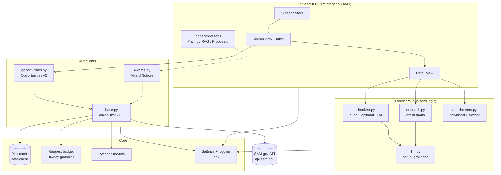

# 🐉 DragonPulse

**Local-first SAM.gov opportunity intelligence for government contractors.**

DragonPulse helps a small/mid-size contractor team **discover** SAM.gov
opportunities, understand **who to contact** and **what to do next**, analyze
**historical award pricing**, maintain a **RAG knowledge base** of past
proposals, and generate **grounded, compliant proposal drafts** — all running
locally on your machine.

> **Design philosophy:** everything local, official APIs only, cache‑first to
> respect tight rate limits, and **every AI output is grounded** in (and cites)
> retrieved context or opportunity metadata. No cloud vector DBs, no mandatory
> external LLM.

---

## ✅ What works today (MVP)

- **Knowledge Base‑driven discovery** via **⭐ Priority Picks** — the primary way
  to find work. It reads your documents, auto‑generates the search queries, and
  surfaces the top 5 best‑fit opportunities (no manual keywords needed).
- **SAM.gov Opportunities v2** search in the **Discover** tab with a deliberately
  minimal set of sidebar filters (**posted‑date range** + **max results**). NAICS
  is currently locked to **237130** and **541330**.
- **Cache‑first API client** with disk caching, a **daily live‑request budget
  guardrail** (protects the 10‑requests/day basic key), pagination, typed
  Pydantic models, and graceful, rate‑limit‑aware error handling.
- **Results table** with key fields + CSV export and direct SAM.gov links.
- **Opportunity detail view**:
  - Full parsed metadata.
  - **Who to reach out to** — every point of contact + one‑click **outreach
    email draft** (grounded template, or LLM‑generated if you opt in).
  - **What needs to be done** — a tailored, **source‑cited** action checklist
    (rules engine + optional LLM enrichment) with deadlines, exportable to
    Markdown.
  - **Attachments** — download resource links + PDF/text preview.
- **Placeholder tabs** wired in for the next modules: Pricing, Knowledge Base
  (RAG), Proposals.

- **Pricing intelligence** (live): pulls historical **Award Notices** for your
  sidebar filters, computes count/min/median/mean/max, charts the award‑amount
  distribution, and lists comparable awards (awardee + amount) with CSV export.
- **RAG knowledge base** (local): upload past proposals/performance (PDF, DOCX,
  TXT, MD) up to **1 GB per file**, index them into an **on‑disk vector store**, and run grounded
  search where every hit **cites its source document + chunk**. Works offline
  with a pure‑NumPy hashing embedding; **auto‑upgrades to semantic embeddings
  via local Ollama** when configured (see below). Ingestion uses **smarter,
  larger semantic chunking** (heading‑ and sentence‑aware, ~900‑token chunks)
  and enriches each document with **metadata** (category, inferred document type,
  and a short summary) plus **context‑aware embeddings** for sharper retrieval.
  Use **♻️ Re‑chunk + re‑index (improved)** to rebuild an existing library with
  these settings without re‑uploading (documents and categories are preserved).
- **Priority Picks** (smart recommendations): reads your Knowledge Base, derives
  the keywords that describe your work, searches SAM.gov (cache‑first), and ranks
  the **top 5 best‑fit opportunities** — each with a plain‑English "why this
  matches" grounded in your own documents, one click from the Detail or Proposal
  tab. **Runs automatically and refreshes every 24 hours** (with manual refresh).

> 🚧 **Not yet built (next phase, awaiting your go‑ahead):** the proposal
> generator. Its building blocks (attachment extraction, grounded LLM wrapper,
> the RAG knowledge base) are already in place.

---

## 🏗️ Architecture



### Request flow (cache‑first)

```text
search() ─▶ build query params ─▶ DiskCache.get()
                                     │ hit (fresh)  ─▶ return cached  ✅ (no quota spent)
                                     │ miss/stale   ─▶ RequestBudget.check()
                                                        ─▶ HTTP GET api.sam.gov (key injected)
                                                        ─▶ RequestBudget.record()
                                                        ─▶ DiskCache.set()  ─▶ return fresh
```

### Project layout

```text
dragonpulse/
├── app.py                         # Streamlit entry point (run this)
├── README.md
├── requirements.txt / -dev.txt
├── pyproject.toml
├── .env.example                   # copy to .env and add your key
├── .streamlit/config.toml
├── data/                          # local-only (gitignored)
│   ├── cache/                     # cached API responses + request budget
│   └── attachments/               # downloaded resource files
├── src/dragonpulse/
│   ├── config/                    # settings (pydantic-settings) + logging
│   ├── cache/                     # disk_cache.py, request_budget.py
│   ├── models/                    # opportunity, award, common, filters
│   ├── api/                       # base, opportunities (v2), awards
│   ├── processors/                # checklist, outreach, attachments, llm,
│   │                              #   pricing, embeddings, text_extract,
│   │                              #   knowledge_base (RAG)
│   └── ui/                        # sidebar, search/detail/pricing/knowledge views
└── tests/                         # pytest: cache, models, checklist, api
```

---

## 🚀 Setup

Requires **Python 3.9+**.

```bash
# 1) Clone / open this folder, then create a virtual environment
python3 -m venv .venv
source .venv/bin/activate          # Windows: .venv\Scripts\activate

# 2) Install dependencies
pip install -r requirements.txt
# (for running tests/linting too)
pip install -r requirements-dev.txt

# 3) Configure your API key
cp .env.example .env
#   then edit .env and set DRAGONPULSE_SAM_API_KEY_BASIC=<your key>
```

### Getting a SAM.gov API key

1. Sign in at <https://sam.gov> and open your **Account Details → API Key**.
2. The personal/basic key allows **10 requests/day** — DragonPulse is built to
   stay well under this via caching and a request‑budget guardrail.
3. Paste it into `.env` as `DRAGONPULSE_SAM_API_KEY_BASIC`.

### Switching to a higher‑tier key later

When your entity registration completes and you receive a system‑account key:

```dotenv
DRAGONPULSE_SAM_API_KEY_SYSTEM=your-higher-limit-key
DRAGONPULSE_API_KEY_TIER=system        # was "basic"
DRAGONPULSE_DAILY_REQUEST_BUDGET=900   # raise the guardrail to match
```

No code changes required.

---

## ▶️ Running the app

```bash
streamlit run app.py
```

Then open the URL Streamlit prints (usually <http://localhost:8501>).

1. Set filters in the sidebar (try a broad keyword + a 14–30 day posted range).
2. Click **🔍 Search** (cache‑first) or **↻ Force refresh** (spends 1 request).
3. Pick an opportunity in **Open an opportunity detail**, then switch to the
   **📄 Detail** tab for contacts, checklist, and attachments.

### Conserving your 10/day quota during development

- The **sidebar Status panel** shows live requests used today and cache stats.
- Cached results are reused for `DRAGONPULSE_CACHE_TTL_SECONDS` (default 12h)
  and **do not** count against your daily budget.
- The client refuses live calls once `DRAGONPULSE_DAILY_REQUEST_BUDGET` is hit
  (default 9, leaving headroom under the 10 limit).
- Tip: do **one** real search per filter set, then iterate against the cache.

---

## 🤖 Optional LLM (opt‑in, off by default)

DragonPulse works fully without an LLM (deterministic, grounded templates).

**Recommended high‑quality model: `llama3.3:70b-instruct-q3_K_M`, fully‑local via
[Ollama](https://ollama.com)** — private, no cloud, no API costs. Its strong
reasoning lets DragonPulse rely on **fewer retrieved chunks** and write more
**original, on‑voice** prose. It needs roughly **34 GB** of RAM/VRAM; if that's
too heavy, `qwen2.5:14b` or `llama3.2:3b` are good lighter fallbacks.

> ⏳ **Note:** the 70B model is the highest‑quality option but is **noticeably
> slower during proposal generation** than the lighter models — expect longer
> per‑section drafting times. Document summaries, checklists, and outreach are
> short and stay fast.

```bash
ollama pull llama3.3:70b-instruct-q3_K_M        # one-time (~34 GB download)
```

```dotenv
DRAGONPULSE_LLM_ENABLED=true
DRAGONPULSE_LLM_BASE_URL=http://localhost:11434/v1
DRAGONPULSE_LLM_MODEL=llama3.3:70b-instruct-q3_K_M
DRAGONPULSE_LLM_API_KEY=ollama      # any placeholder; local servers ignore it
```

Prefer a cloud provider instead? Leave `DRAGONPULSE_LLM_BASE_URL` blank and set
`DRAGONPULSE_LLM_API_KEY=sk-...` + `DRAGONPULSE_LLM_MODEL=gpt-4o-mini`.

Every LLM prompt is constrained to provided context and instructed to **cite
its sources**; if the LLM is unavailable or errors, DragonPulse silently falls
back to the grounded template so the UI never breaks.

---

## 📚 Knowledge base embeddings (lexical vs. semantic)

The RAG knowledge base works out of the box with a **pure‑NumPy lexical
(keyword) embedding** — fully offline, no downloads, no API keys. For much
better retrieval quality, upgrade to **semantic embeddings via local Ollama**:

```bash
# One-time: pull the local embedding model
ollama pull nomic-embed-text
```

```dotenv
# In .env — embeddings only need the base URL (you do NOT have to enable the chat LLM)
DRAGONPULSE_LLM_BASE_URL=http://localhost:11434/v1
# Optional overrides (these are the defaults):
DRAGONPULSE_RAG_EMBEDDING_BACKEND=auto          # auto -> Ollama if base URL set, else lexical
DRAGONPULSE_RAG_EMBEDDING_MODEL=nomic-embed-text
```

How the switch works:

- **Automatic detection:** with `auto` (the default), DragonPulse uses Ollama
  `nomic-embed-text` whenever `DRAGONPULSE_LLM_BASE_URL` is set and reachable,
  and otherwise falls back to the lexical method.
- **Graceful fallback:** if Ollama is down or the model isn't pulled, it quietly
  uses lexical search and the Knowledge Base tab shows a warning telling you why.
- **Automatic re‑indexing:** when the embedding method changes, your already‑
  uploaded documents are re‑embedded **from their stored text** — no re‑uploading.
  On a running app you can also click **🔄 Re‑index** in the Knowledge Base tab.
- **Active method is always visible:** the Knowledge Base tab shows
  "Using semantic embeddings via Ollama" or "Using lexical (keyword) search".
- **Fully local:** no external API keys are ever required for embeddings.

### Managing your documents

The Knowledge Base tab is a small document manager:

- **Bulk upload** — drag in many PDFs/DOCX/TXT/MD at once (up to **1 GB per
  file**); a progress bar tracks indexing.
- **Automatic OCR** — scanned / image-only PDFs (no text layer) are recognized
  on upload with **PyMuPDF + Tesseract**, fully locally. Install the engine once
  (`brew install tesseract`); without it, such PDFs are skipped with a clear
  message. Tune render quality with `DRAGONPULSE_KB_OCR_DPI`.
- **Organize into categories** — assign a folder‑like category at upload
  (Past Performance, Capabilities, Technical, Management, Pricing,
  Certifications, Other) and optional tags. Re‑assign a document's category later
  from the library, and **filter** the library by category.
- **Rich metadata** — each document shows its chunk count, character count,
  added date, **last‑indexed** date, and source type.
- **Re‑index all documents** — one click rebuilds every embedding (e.g. after
  switching backends).
- **Delete** individual documents or clear the whole base.

---

## ⭐ Priority Picks (smart recommendations)

The **Priority Picks** tab is the **main, Knowledge Base‑driven way to discover
opportunities**. It turns "what your firm has done" into "what your firm should
bid on next" — with **minimal manual input**. It runs **automatically** on open,
shows the **top 5 best‑fit** opportunities, and **refreshes every 24 hours**.

**How it works:**

1. **Mine your documents (no manual keywords).** It automatically reads your
   **Capabilities**, **Technical**, and **Past Performance** documents and
   extracts **broad capability/service keywords** that recur *across* documents
   (e.g. `power`, `excitation`, `engineering services`, `substation`), while
   filtering out one‑off project names and locations (e.g. `libby dam`,
   `army corps`). The result tracks *what your firm does*, not a single project.
2. **Search SAM.gov (cache‑first, budget‑aware, with a keyless crawl fallback).**
   Each keyword becomes one Opportunities `/search` call, reusing the disk cache
   wherever possible. The hardcoded **NAICS codes (237130, 541330)** and an
   internal **last‑120‑day window** scope the search (the date range is not shown
   here). If the daily live‑request budget is reached, Priority Picks first
   **falls back to crawling SAM.gov's public site** (the same keyless method as
   the manual link loader — *no API requests used*). If that also can't return
   anything, it shows **one clean message** with an auto‑retry countdown, e.g.
   *"Daily SAM.gov request limit reached. Priority Picks will automatically try
   again in 6h 14m."*
3. **Rank by fit.** De‑duplicated candidates are scored by **semantic similarity
   to your library** (reusing the Knowledge Base's embedding backend), with a
   small bonus for matching multiple keywords, then sorted with soonest deadlines
   breaking ties.

**Each recommendation shows** Title · Agency · NAICS · days left/deadline ·
set‑aside, a **"Why this matches"** explanation grounded in your documents, and an
expandable list of the exact **evidence chunks** (cited) that drove the match.

**Controls (kept intentionally light):** it runs and refreshes on its own once
every 24 hours; click **🔄 Refresh now** to re‑run immediately and bypass the
cache. Under *Advanced* you can broaden/narrow the document categories it learns
from. Results are cached per‑configuration, so reopening the tab makes **no new
API calls**.

**Integration:** from any pick, click **📄 Open in Detail** or **📝 Draft
proposal** to send that opportunity straight into the Detail or Proposal
Generator tab (then switch to that tab).

If the Knowledge Base is empty (or has no documents in the selected categories),
Priority Picks shows a clear message instead of calling the API.

---

## 📌 Manually load an opportunity (zero API calls)

Already found an opportunity on SAM.gov but **out of daily API requests** — or just
want to start fast? Load it by hand — no network involved.

**Fastest path (Proposals tab): upload the PDF.** In the **📝 Proposals** tab,
open **"📌 Manually load an opportunity (upload PDF) — zero API calls"** and:

1. **Upload the solicitation / SOW PDF(s)** — this is the primary step and all you
   really need. Files are extracted locally, with automatic **OCR** for scanned
   PDFs.
2. *(Optional)* Paste the **SAM.gov link** / **Notice ID** and add a **title** and
   **agency** (plus solicitation # / NAICS under "More details").
3. Click **🚀 Load & start drafting (no API call)**.

DragonPulse builds a **local opportunity record**, indexes your uploaded
solicitation, selects it, and drops you right at **⚙️ Generate Draft** — one click
from a grounded proposal. If you don't paste a link, a local Notice ID is minted
for you. Everything is processed on your machine; the daily request budget is
**never touched**.

**Auto-fill from a SAM.gov link (Proposals tab).** Open **"🔗 Load from SAM.gov
link (no API call)"** and paste a full opportunity URL
(`https://sam.gov/workspace/contract/opp/<ID>/view`). DragonPulse reads SAM.gov's
**public page data** — the same endpoints your browser uses, **not** the
rate-limited `api.sam.gov` key — and auto-fills:

- **Title**, **Agency / Office**, **Notice ID**, **Solicitation #**
- **Notice type**, **NAICS**, **set-aside**, **response deadline**
- **Place of performance**, **points of contact**
- **Scope / description** (indexed automatically so you can draft right away)
- **Attachment list**

It then registers and selects the opportunity — **zero of your SAM.gov API
requests are used**. Add the SOW PDF for fuller grounding if you have it. Invalid
links and parsing problems are reported clearly, with the PDF-upload path as a
fallback.

**Link-only path (Discover tab):** open the manual-load expander to paste a
**SAM.gov link** or **Notice ID** (plus optional metadata) to register the record,
then add the solicitation in the Proposal Generator.

A manually loaded opportunity behaves like any other for **drafting proposals**,
the **Compliance Matrix**, and **saving drafts**. You can always add or replace the
solicitation later via the Proposal Generator's **"➕ Add solicitation"** step,
which accepts either **pasted SOW / Section L/M text** or **uploaded file(s)**
(PDF, DOCX, TXT, MD).

---

## 📝 Proposal Generator

The **Proposal Generator** tab turns a solicitation + your Knowledge Base into a
grounded, source‑cited proposal draft. Every sentence can be traced back to
either the solicitation or one of your own documents — nothing is invented.

**How it works (per section):**

1. The opportunity's attachments (SOW / solicitation) are downloaded, text‑
   extracted, chunked, and embedded into an *ephemeral* in‑memory index using the
   same embedding backend as the Knowledge Base.
2. A section‑specific query retrieves the most relevant **solicitation** passages
   **and** the most relevant **company** chunks from your RAG Knowledge Base.
3. The same query also pulls a few **writing‑style exemplars** from the document
   *categories* that best fit the section — e.g. **Technical** for the Technical
   Approach, **Past Performance** for past‑performance — so each section is modeled
   on how *your* company actually writes that kind of content.
4. All contexts (each labeled for citation) plus the opportunity metadata are
   handed to your local LLM with a **style‑matching system prompt**: write *as your
   company* (inferring its real name from your documents), mirror the tone,
   structure, headings, bullet style, and vocabulary of the exemplars, and *adapt
   and rephrase* your own content rather than emitting generic corporate
   boilerplate. With no LLM, you still get a **grounded evidence scaffold** (real
   excerpts, nothing fabricated).

**Sections generated:** Executive Summary · Technical Approach · Management &
Staffing Plan · Relevant Past Performance · Differentiators · (optional)
high‑level Pricing Strategy notes.

### The Knowledge Base is *learning material*, not a fact dump

The generator treats your Knowledge Base primarily as **training material for your
company's voice, style, capabilities, and proposal structure** — it learns from
your documents and then writes a *new* section tailored to the current
opportunity. It does **not** force unrelated content into drafts:

- **Style vs. facts are separated.** Each section gets a few **writing‑style
  references** (drawn from the most relevant categories — Technical and Past
  Performance are prioritized) that the model studies for *tone, structure,
  headings, and phrasing only* — explicitly instructed **not** to copy their
  specific projects/numbers unless they directly apply.
- **Relevance‑gated facts.** Company knowledge‑base passages are offered as
  **optional reference, used only when directly relevant** to the solicitation.
  Low‑relevance chunks are dropped, and the volume injected is kept small so the
  model isn't tempted to pad the draft with off‑topic details.
- **Original where needed.** When nothing in the KB is clearly relevant for a
  section, the model writes from solicitation requirements and industry best
  practices — still in your company's voice — instead of inserting unrelated
  material.
- **No fabrication, proper citations.** Solicitation facts come from the
  solicitation; company‑specific facts (named contracts, customers, dollar
  amounts, certifications) come from the KB and are never invented. Specific KB or
  solicitation content is cited with a bracketed source label.
- **Sounds like you.** The model writes in the first person as your company (name
  inferred from your KB), reusing your characteristic phrasing and terminology and
  avoiding generic boilerplate.
- **Transparent.** Each section's caption shows how many **style reference(s)** it
  used, and the **📚 Sources / citations** popover lists style references
  separately from the factual KB sources actually used.

**How to use it:**

1. Run a search in **Discover** (or open one in **Detail**).
2. Open the **Proposal Generator** tab and pick the opportunity. Its attachments
   are **auto‑loaded and extracted in the background** with a live status message
   — no extra click. (Use **🔄 Reload attachments** or paste the SOW text manually
   as a fallback for scanned/unavailable files.)
3. Click **⚙️ Generate Draft**. Each section appears in an expander with a
   **📚 Sources / citations** popover showing the exact excerpts used.
4. Refine any section with chat‑style feedback (e.g. *"focus on liquid cooling"*)
   and click **🔁 Regenerate** — it re‑uses the solicitation + KB context.
5. **Export** the whole draft to **Markdown** or **DOCX**.

The **Relevant Past Performance** section is extra careful: it pulls a wider set
of knowledge‑base matches and, when there's no strong direct match, it stays
honest — framing the most relevant work as **transferable experience** instead of
overclaiming.

### Saved drafts & version history

Every draft can be **saved locally** with a name (stored under `data/drafts/`).
Per opportunity you get a list of saved drafts showing the **created** and
**last‑modified** times and a **version** number. You can **load** a previous
draft to keep working, **update** the one you loaded (which bumps its version),
or **delete** old drafts. Nothing leaves the machine.

**For full AI prose**, enable a local model in `.env` (everything stays local):

```bash
ollama pull llama3.3:70b-instruct-q3_K_M   # recommended (qwen2.5:14b / llama3.2:3b are lighter & faster)
# in .env:
DRAGONPULSE_LLM_ENABLED=true
DRAGONPULSE_LLM_BASE_URL=http://localhost:11434/v1
DRAGONPULSE_LLM_MODEL=llama3.3:70b-instruct-q3_K_M
```

> The 70B model gives the best drafting quality but is **slower per section**;
> switch `DRAGONPULSE_LLM_MODEL` to `qwen2.5:14b` for faster (lighter) drafting.

Without an LLM the tab still works and produces a grounded, cited scaffold.

### Compliance Matrix

After a draft is generated, DragonPulse automatically builds a **Compliance
Matrix** — a focused requirement‑traceability table so you can see, at a glance,
whether the draft covers what the solicitation demands.

**What it captures (the most important items, not everything):**

- **Requirement / Evaluation Factor** — the obligation an offeror must meet.
- **Category** — Section L (instructions), Section M (evaluation), Evaluation,
  SOW (`shall`/`must`), or Other.
- **Source** — a citation back to the exact solicitation chunk it came from.
- **Proposal Section** — which generated section best addresses it (auto‑mapped
  via semantic similarity).
- **Status** — Addressed / Partial / Not Addressed (a conservative auto‑estimate
  you can override).
- **Notes** — free‑text, user‑editable.

**How it's built:**

- With an LLM, requirements are extracted in JSON mode from the Section L/M and
  `shall`/`must` portions of the solicitation, each tied to its source chunk.
- Without an LLM, a regex fallback pulls the key `shall`/`must`/evaluation
  sentences — so the matrix still works fully offline.
- Each requirement is then mapped to the best‑matching proposal section locally
  (cosine similarity), and a starting Status is derived from that score.

**Use it:** edit **Status** and **Notes** directly in the table. Pick any
requirement and click **💪 Strengthen this section** to regenerate the mapped
proposal section with the goal of explicitly addressing that requirement — the
rest of the draft stays intact and the section's revision history records the
change. Export the matrix on its own as **Markdown** or **Excel (.xlsx)**, or get
it appended automatically to the full‑proposal **Markdown** and **DOCX** exports.

---

## 🧪 Tests

```bash
pytest                       # unit tests (mocked transport, no network)
DRAGONPULSE_RUN_LIVE=1 pytest -m live    # opt-in: hits real API (uses 1 request)
```

Covered: cache TTL + secret scrubbing, request budget, model parsing, filter →
query‑param translation, checklist grounding, the cache‑first API client,
grounded proposal generation, compliance‑matrix extraction/export, the saved‑
draft store + version history, knowledge‑base categories/metadata, section
strengthening, and the past‑performance transferable‑experience logic.

---

## 🔐 Security & privacy notes

- **Local‑first:** API responses and downloaded attachments stay on disk in
  `data/` (gitignored). Nothing is sent anywhere except SAM.gov (and your LLM
  endpoint, only if you opt in).
- **Secrets:** API keys are read from `.env`, never logged in full (masked to
  `abcd…(redacted)`), and never written into cache files.
- **Sensitive text:** extracted SOW/proposal text is never logged — only file
  names, sizes, and page counts.

---

## ⚙️ Configuration reference (`.env`)

| Variable | Default | Purpose |
| --- | --- | --- |
| `DRAGONPULSE_SAM_API_KEY_BASIC` | – | Basic 10/day key |
| `DRAGONPULSE_SAM_API_KEY_SYSTEM` | – | Higher‑tier key (added later) |
| `DRAGONPULSE_API_KEY_TIER` | `basic` | `basic` or `system` |
| `DRAGONPULSE_DEFAULT_NAICS` | – | Comma‑separated default NAICS (sidebar NAICS controls are currently hidden; discovery uses hardcoded 237130 & 541330) |
| `DRAGONPULSE_CACHE_TTL_SECONDS` | `43200` | Cache freshness window (12h) |
| `DRAGONPULSE_CACHE_DISABLED` | `false` | Bypass cache entirely |
| `DRAGONPULSE_DAILY_REQUEST_BUDGET` | `9` | Daily live‑request guardrail |
| `DRAGONPULSE_LOG_LEVEL` | `INFO` | Logging verbosity |
| `DRAGONPULSE_LLM_ENABLED` | `false` | Master switch for the LLM |
| `DRAGONPULSE_LLM_BASE_URL` | – | OpenAI‑compatible base URL (local OK) |
| `DRAGONPULSE_LLM_API_KEY` | – | LLM credential |
| `DRAGONPULSE_LLM_MODEL` | `llama3.3:70b-instruct-q3_K_M` | Model name (recommended local primary; slower) |
| `DRAGONPULSE_RAG_EMBEDDING_BACKEND` | `auto` | `auto`/`hashing`/`ollama`/`sentence_transformers` |
| `DRAGONPULSE_RAG_EMBEDDING_MODEL` | `nomic-embed-text` | Model for ollama/ST backends |
| `DRAGONPULSE_RAG_CHUNK_CHARS` | `3600` | Target characters per chunk (~900 tokens) |
| `DRAGONPULSE_RAG_CHUNK_OVERLAP` | `400` | Overlap between chunks |
| `DRAGONPULSE_RAG_TOP_K` | `5` | Default retrieved chunks |
| `DRAGONPULSE_KB_SUMMARIZE` | `true` | Generate a short per-document summary at ingestion |
| `DRAGONPULSE_KB_MAX_UPLOAD_MB` | `1000` | Max Knowledge Base upload size per file (MB) |
| `DRAGONPULSE_KB_OCR_ENABLED` | `true` | Auto-OCR scanned/image-only PDFs on upload |
| `DRAGONPULSE_KB_OCR_DPI` | `200` | Render DPI for OCR (higher = slower, more accurate) |

> **Note:** Streamlit's server upload cap is set in `.streamlit/config.toml`
> (`maxUploadSize = 1000`). Keep it in sync with `DRAGONPULSE_KB_MAX_UPLOAD_MB`
> and restart the app after changing either value.

---

## 🗺️ Roadmap (next phases)

1. ✅ **Pricing intelligence** — award‑amount distributions for comparable
   NAICS/keywords + comparable awards (awardee + amount). **Done.**
2. ✅ **RAG knowledge base** — local chunking + embeddings + on‑disk vector store
   for past proposals/performance, with cited retrieval. **Done.**
3. ✅ **Proposal generator** — grounded, source‑cited section drafts from the
   solicitation (SOW) + your knowledge base, with per‑section regeneration and
   Markdown/DOCX export. **Done.**
4. ✅ **Compliance matrix** — auto‑extracted Section L/M & `shall` requirements
   mapped to proposal sections, with editable status/notes and Markdown/Excel/
   DOCX export, plus per‑requirement **"strengthen this section"**. **Done.**
5. ✅ **Workflow polish** — auto‑loaded solicitation attachments, knowledge‑base
   categories/bulk management, and **saved drafts with version history**. **Done.**
6. ✅ **Priority Picks** — the **primary**, Knowledge Base‑driven opportunity
   recommender: auto‑derives keywords from your documents, searches SAM.gov
   (cache‑first/budget‑aware), and ranks the **top 5** best‑fit opportunities with
   a grounded "why this matches." Runs automatically and **refreshes every 24h**.
   **Done.**

### Possible future enhancements

- Multi‑opportunity batch drafting.
- Compliance matrix → DOCX "jump to section" cross‑links.
